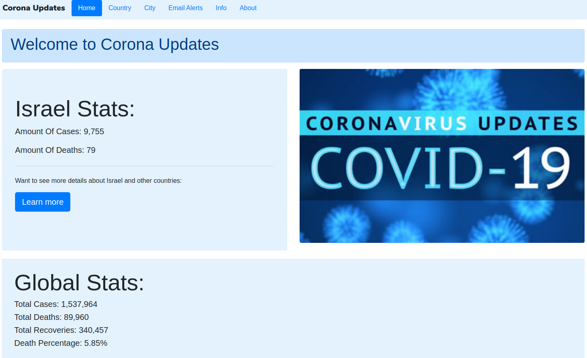
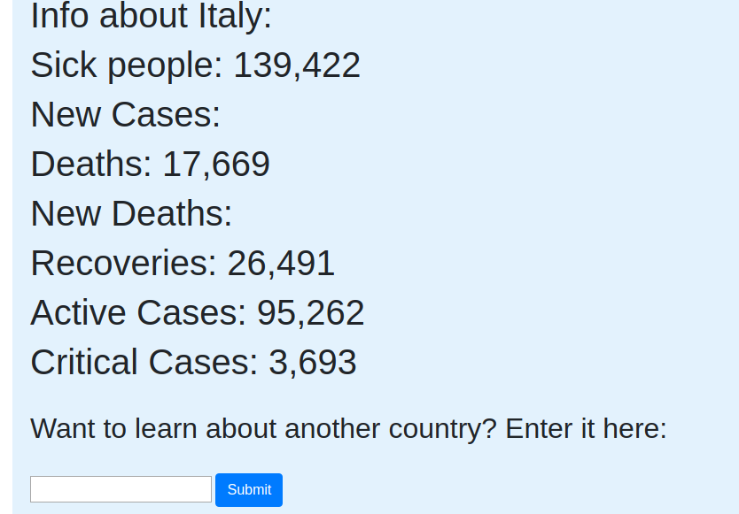

# Corona Updates
> ☢️ Corona Global, Country & City Updates!

  

  
  
  

This is a web app written in python which gives the user global stats, country stats and even country stats.
The web app also alerts the user by email everytime their is a change in their city.

# Main Page

  

# Country Page

  

# City Page

  

# Email Alert Page

  

## Author
* **Micael Illos** - *Get in touch* - <a href="https://micaelil.com"> Website </a>
* **Eitan Bloch**
